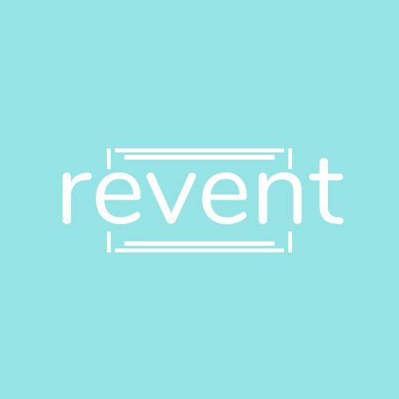
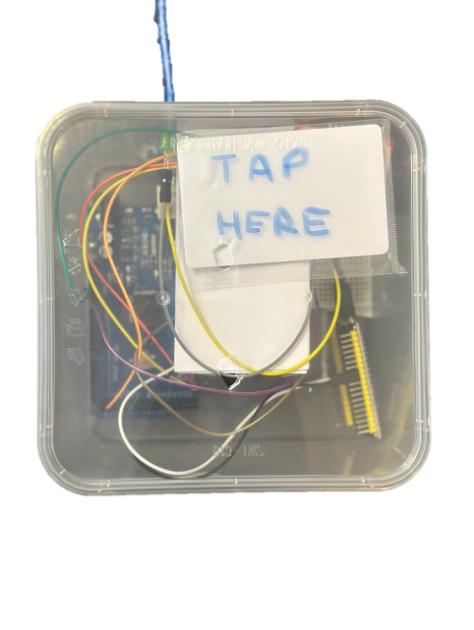
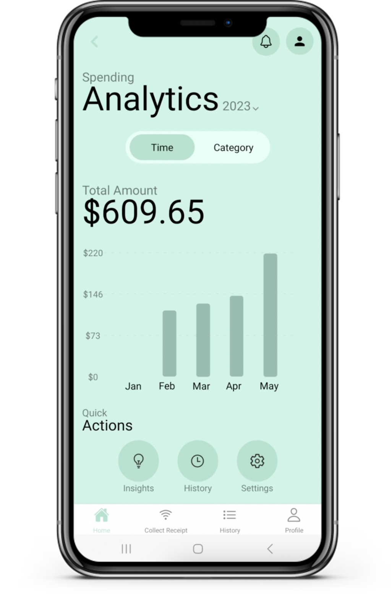
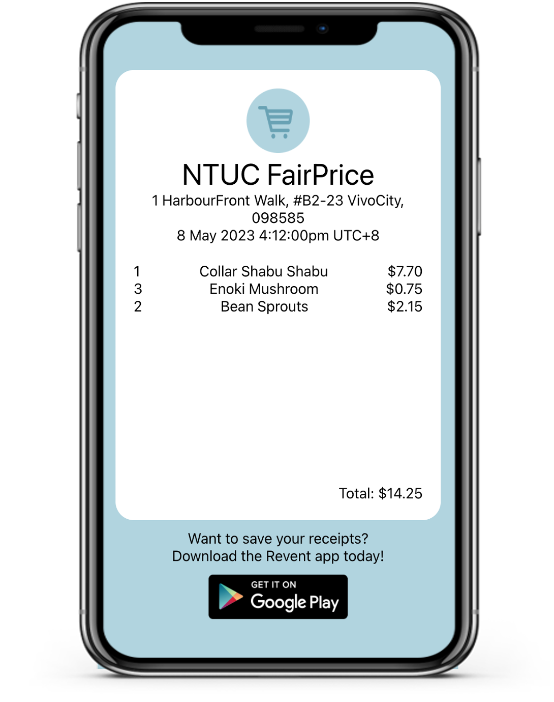

# Revent

## Hack Singapore 2023 (Theme 2: Sustainability)

### Alibaba Cloud Problem Statement 2

Create an application that promotes sustainable consumption: This hackathon challenge would require participants to create a mobile or web application that encourages users to adopt more sustainable consumption habits. The application could offer personalized recommendations on sustainable products or services based on users' interests, location, and behavior.

<!-- PROJECT LOGO -->
 

    
  <h3 align="center">Revent</h3>

  

    Combination of both hardware and software to enable <strong>sustainable</strong> consumption through eliminating the need for paper receipts in retail transactions
  

<!-- ABOUT THE PROJECT -->

## About The Project

### How can we enable sustainable consumption through eliminating receipt waste?

Revent is a tech solution that combines both hardware and software to enable sustainable consumption through eliminating the need for paper receipts in retail transactions. Paper receipts have always posed a significant problem, contributing to paper waste, increased health risks, and additional costs to retail businesses. However, given these stark problems, limited efforts have been made by retailers and consumers within Singapore to phase out the use of paper receipts.

Using a machine learning integration layer, Revent’s hardware is able to interpret incoming receipt data, hence, it is able to integrate with point-of-sale terminals across different retailers seamlessly. Revent’s hardware utilises near field communication (NFC) technology to enable contactless distribution of digital receipts to the customers’ phones. Regardless of whether they have downloaded our application, customers can receive their receipt by simply tapping their smartphones on our device.

If the Revent application is not installed, the digital receipt will display on a webpage.
If the Revent application is installed, the digital receipt will display in the app and be stored in the users’ account.
Features of the application include:
Consolidated purchase history
Monthly expense tracker
Spending breakdown into categories, e.g. food, grocery, shopping and more

In cases where users of the application wish to migrate their physical or external digital receipts into our application, they can manually upload it as well.

### Video Links

- Pitch: https://www.youtube.com/watch?v=w_XHEvJ7aUs
- Product Demo (Updated): https://youtu.be/SBS9kOuSFaI

(<a href="#readme-top">back to top</a>)

## Product

Our product primarily consists of three components: Hardware, Mobile Application and Web Application.

### Hardware

### Mobile Application

### Web Application

## Repositories

Go to each of the repositories for a detailed readme explaining the deployment instructions.

[Hardware](https://github.com/Revent-eco/Revent/tree/main/Revent-Hardware)

[App](https://github.com/Revent-eco/Revent/tree/main/Revent-App)

[Web](https://github.com/Revent-eco/Revent/tree/main/Revent-Web)

[Backend](https://github.com/Revent-eco/Revent/tree/main/Revent-Backend)

## Commit History

As this repository is made for submission to compile 4 of our repositories, attached below are the commit histories of each repository as proof of work during this competition period.

[Hardware](https://github.com/Revent-eco/Revent/tree/main/Revent-Hardware/COMMIT.md)

[App](https://github.com/Revent-eco/Revent/tree/main/Revent-App/COMMIT.md)

[Web](https://github.com/Revent-eco/Revent/blob/main/Revent-Web/COMMIT.md)

[Backend](https://github.com/Revent-eco/Revent/tree/main/Revent-Backend/COMMIT.md)

## Built With

[![React][react.js]][React-JS] [![React Native][React_Native]][React-Native-url] [![Node Js][Node.js]][Node.js-url] [![Firebase][firebase]][firebase-url] [![Arduino][arduino]][Arduino-url]

(<a href="#readme-top">back to top</a>)

<!-- CONTACT -->

## Contact

 Anand Chaanan Singh - [Github](https://github.com/csa100) | [Linkedin](https://sg.linkedin.com/in/chaanan-anand-8b2a761b0)

 Anand Chiraag Singh - [Github](https://github.com/Snail664) | [Linkedin](https://sg.linkedin.com/in/chiraag-anand-33b6671b9)

 Bryan Lim - [Github](https://github.com/zonpig) | [Linkedin](https://sg.linkedin.com/in/bryan-lim-b9a95a1bb)

 Ng Yong Jie - [Github](https://github.com/zonpiyongjicodeg) | [Linkedin](https://sg.linkedin.com/in/yongjie-ng)

(<a href="#readme-top">back to top</a>)

<!-- MARKDOWN LINKS & IMAGES -->
<!-- https://www.markdownguide.org/basic-syntax/#reference-style-links -->

[react.js]: https://img.shields.io/badge/react-%2320232a.svg?style=for-the-badge&logo=react&logoColor=%2361DAFB
[React-JS]: https://react.dev
[react_native]: https://img.shields.io/badge/React_Native-20232A?style=for-the-badge&logo=react&logoColor=61DAFB
[React-Native-url]: https://reactnative.dev/
[Node.js]: https://img.shields.io/badge/Node.js-43853D?style=for-the-badge&logo=node.js&logoColor=white
[Node.js-url]: http://nodejs.org
[firebase]: https://img.shields.io/badge/firebase-%23039BE5.svg?style=for-the-badge&logo=firebase
[firebase-url]: https://firebase.google.com
[arduino]: https://img.shields.io/badge/-Arduino-00979D?style=for-the-badge&logo=Arduino&logoColor=white
[Arduino-url]: https://www.arduino.cc/
