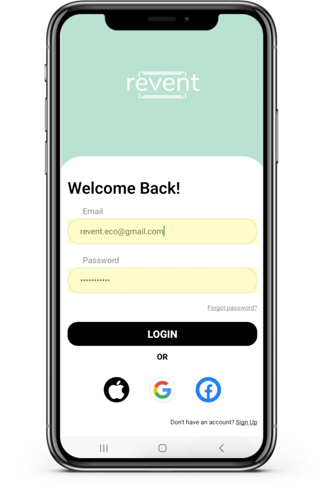
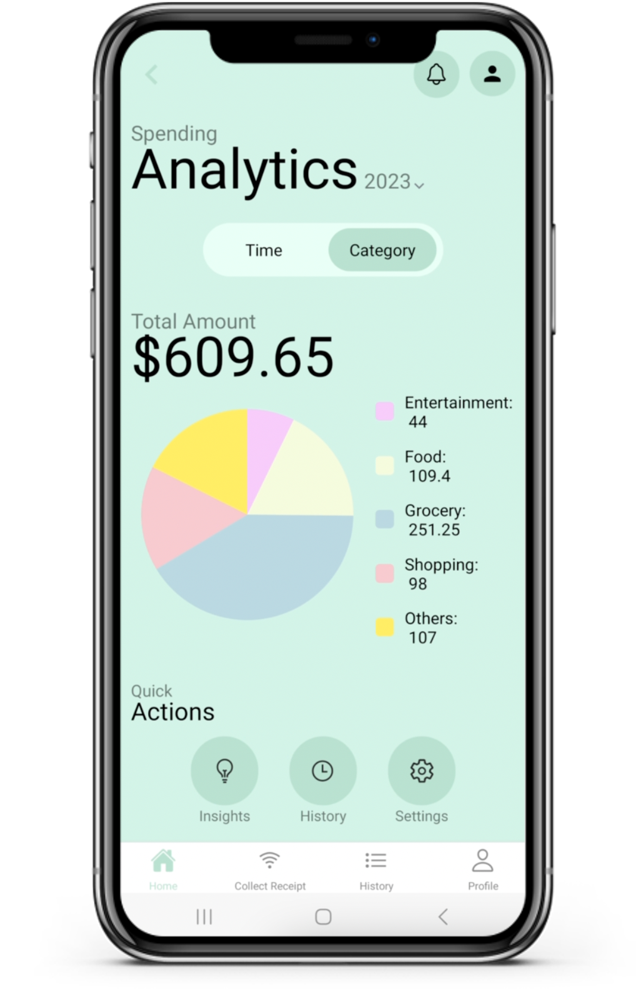
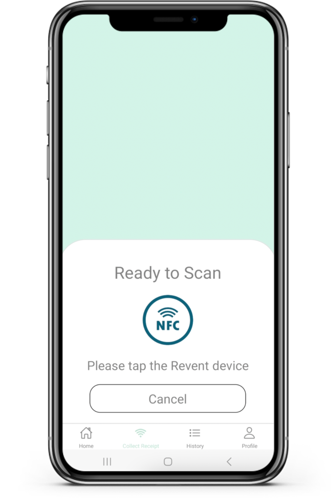
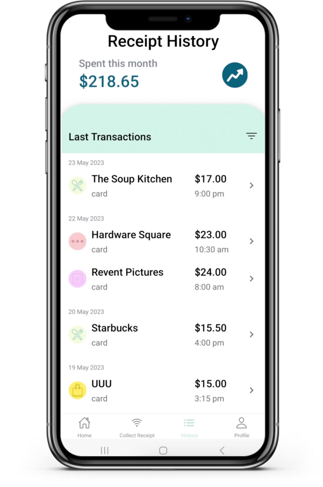
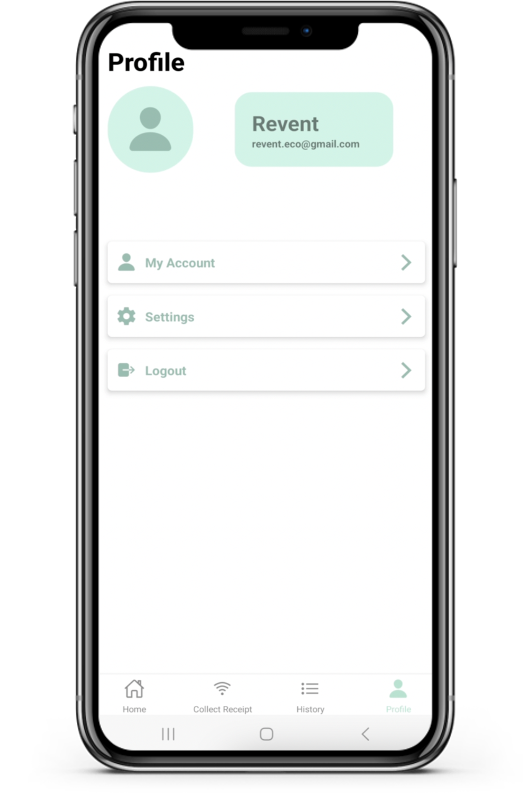

<a name="readme-top"></a>

# Revent App

<!-- PROJECT LOGO -->
<br />
<div align="center">
    

  <h3 align="center">Revent App</h3>

  <p align="center">
    A mobile app for everybody to obtain e-receipts
  </p>
</div>

<!-- TABLE OF CONTENTS -->
<details>
  <summary>Table of Contents</summary>
  <ol>
    <li>
      <a href="#about-the-project">About The Project</a>
      <ul>
        <li><a href="#screens">Screens</a></li>
      </ul>
      <ul>
        <li><a href="#built-with">Built With</a></li>
      </ul>
            <ul>
        <li><a href="#libraries-used">Libraries Used</a></li>
      </ul>
    </li>
    <li>
      <a href="#getting-started">Getting Started</a>
      <ul>
        <li><a href="#prerequisites">Prerequisites</a></li>
        <li><a href="#installation">Installation</a></li>
        <li><a href="#running-application">Running  Application</a></li>
      </ul>
    </li>
    <li><a href="#usage">Usage</a></li>
  </ol>
</details>

<!-- ABOUT THE PROJECT -->

## About The Project

The Revent App allows customers to store the receipts they receive through the Revent device. This allows users to access their purchase history and track their spendings whenever they wish to.

Additional feature of our app allows users to view their monthly expenses and spending breakdown. Breaddown categories include:

- Food
- Grocery
- Entertainment
- Shopping
- Others

<p align="right">(<a href="#readme-top">back to top</a>)</p>

### Screens

<b>Login<b/>


<p align="right">(<a href="#readme-top">back to top</a>)</p>

<b>Home (Time)<b/>


<p align="right">(<a href="#readme-top">back to top</a>)</p>

<b>Home (Category)<b/>


<p align="right">(<a href="#readme-top">back to top</a>)</p>

<b>Collect Receipt<b/>


<p align="right">(<a href="#readme-top">back to top</a>)</p>

<b>Receipt History<b/>


<p align="right">(<a href="#readme-top">back to top</a>)</p>

<b>Profile<b/>


<p align="right">(<a href="#readme-top">back to top</a>)</p>

### Built With

[![React Native][React_Native]][React-Native-url][![Firebase][firebase]][firebase-url]

### Libraries Used

React-Native Libraries used:

- react-native-elements
- react-native-nfc-manager
- react-navigation
- react-native-gifted-charts
- react-redux

<p align="right">(<a href="#readme-top">back to top</a>)</p>

<!-- GETTING STARTED -->

## Getting Started

To get a local copy up and running follow these simple example steps.

### Prerequisites

- npm

  ```sh
  npm install npm@latest -g
  ```

- Ensure that your [Java Version](https://www.oracle.com/java/technologies/javase/jdk17-archive-downloads.html) is <=v17
- Install [Android Studio](https://developer.android.com/studio/index.html)
- Add the following lines to your ~/.zprofile or ~/.zshrc (if you are using bash, then ~/.bash_profile or ~/.bashrc) config file:

  ```sh
  export ANDROID_HOME=$HOME/Library/Android/sdk
  export PATH=$PATH:$ANDROID_HOME/emulator
  export PATH=$PATH:$ANDROID_HOME/platform-tools
  ```

  For more details, [click here](https://reactnative.dev/docs/environment-setup)

### Installation

1. Set up your firebase project at [https://firebase.google.com/](https://firebase.google.com/)
2. Clone the repo

   ```sh
   git clone https://github.com/your_username_/Project-Name.git
   ```

3. Install NPM packages

   ```sh
   cd Revent
   npm install
   ```

4. Enter your project details in `.env`

   ```sh
    REACT_APP_FIREBASE_API_KEY =
    REACT_APP_FIREBASE_AUTH_DOMAIN =
    REACT_APP_FIREBASE_PROJECT_ID =
    REACT_APP_FIREBASE_STORAGE_BUCKET =
    REACT_APP_FIREBASE_MESSAGING_SENDERID =
    REACT_APP_FIREBASE_APP_ID =
   ```

### Running Application

- To run the application

  ```sh
    npm run android
  ```

<p align="right">(<a href="#readme-top">back to top</a>)</p>

<!-- CONTACT -->

## Contact

 Anand Chaanan Singh - [Github](https://github.com/csa100) | [Linkedin](https://sg.linkedin.com/in/chaanan-anand-8b2a761b0)

 Anand Chiraag Singh - [Github](https://github.com/Snail664) | [Linkedin](https://sg.linkedin.com/in/chiraag-anand-33b6671b9)

 Bryan Lim - [Github](https://github.com/zonpig) | [Linkedin](https://sg.linkedin.com/in/bryan-lim-b9a95a1bb)

 Ng Yong Jie - [Github](https://github.com/zonpiyongjicodeg) | [Linkedin](https://sg.linkedin.com/in/yongjie-ng)

<p align="right">(<a href="#readme-top">back to top</a>)</p>

<!-- MARKDOWN LINKS & IMAGES -->
<!-- https://www.markdownguide.org/basic-syntax/#reference-style-links -->

[react_native]: https://img.shields.io/badge/React_Native-20232A?style=for-the-badge&logo=react&logoColor=61DAFB
[React-Native-url]: https://reactnative.dev/
[firebase]: https://img.shields.io/badge/firebase-%23039BE5.svg?style=for-the-badge&logo=firebase
[firebase-url]: https://firebase.google.com
