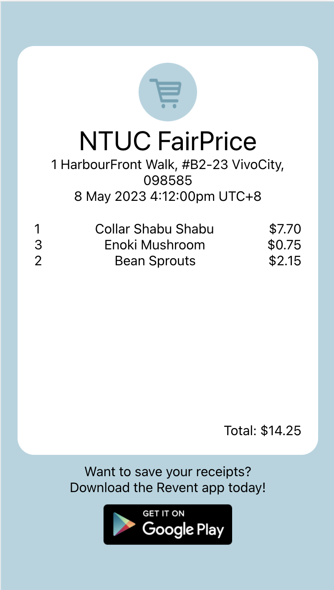
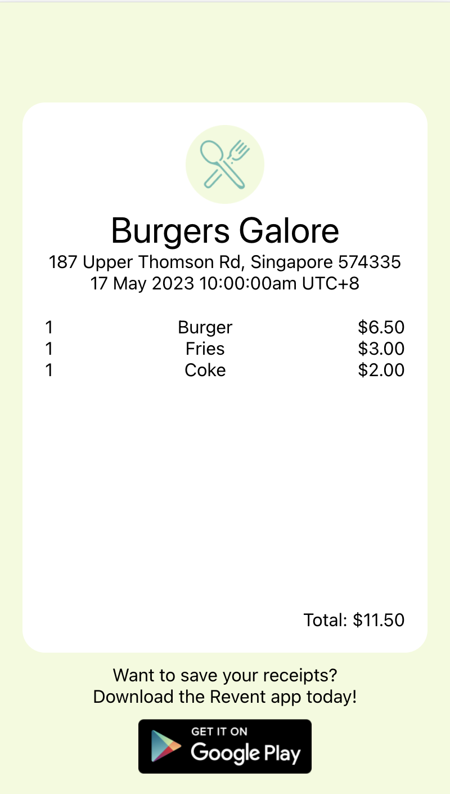
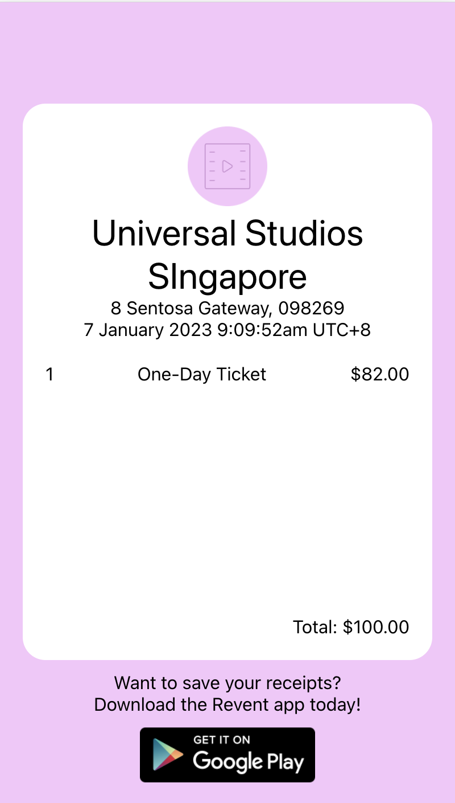
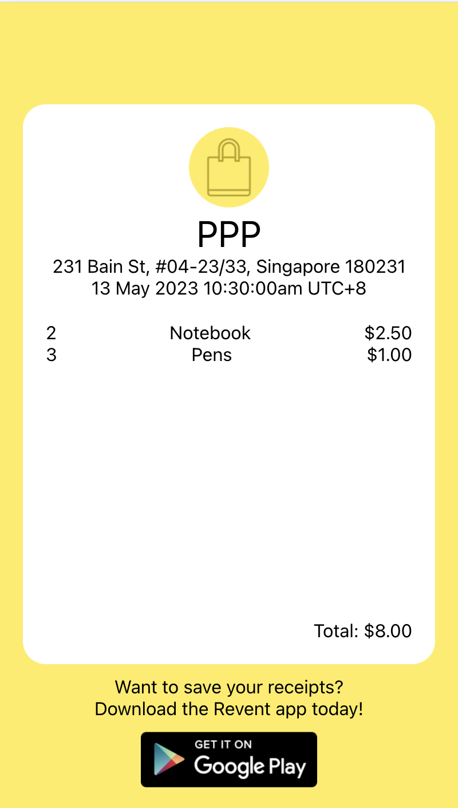
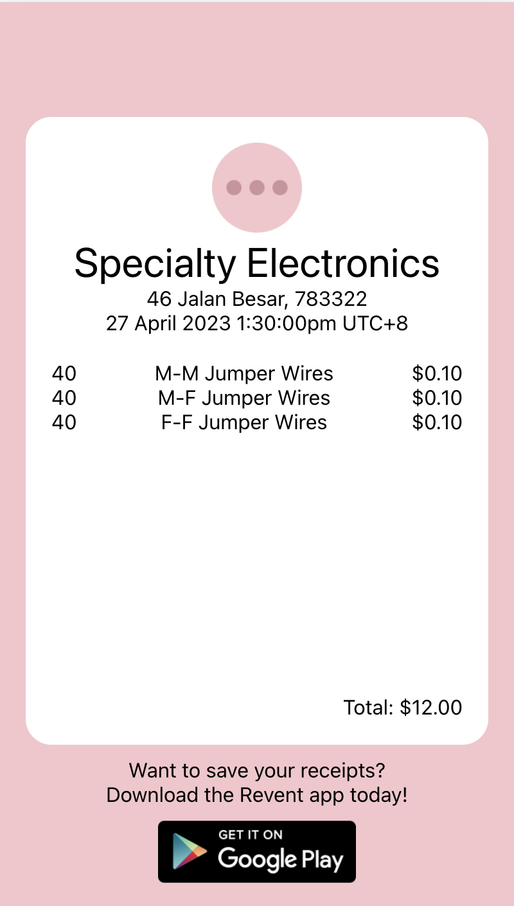

<a name="readme-top"></a>

# Revent Web

<!-- PROJECT LOGO -->
<br />
<div align="center">
    

  <h3 align="center">Revent Web</h3>

  <p align="center">
    A website built to display e-receipts
  </p>
</div>
<!-- ABOUT THE PROJECT -->

## About The Project

Revent Web allows for customers that do not have the Revent App to be able to view their receipts.

### Webpage

<div align="center">

  <a href="https://revent-eco.web.app/2ArNrk7T9GNvLNV1Q39h">
    
    </a>

</div>

<p align="right">(<a href="#readme-top">back to top</a>)</p>

### Built With

[![React][react.js]][React-JS][![Firebase][firebase]][firebase-url]

<p align="right">(<a href="#readme-top">back to top</a>)</p>

<!-- GETTING STARTED -->

## Getting Started

To get a local copy up and running follow these simple example steps.

### Prerequisites

- npm

  ```sh
  npm install npm@latest -g
  ```

### Installation

1. Set up your firebase project at [https://firebase.google.com/](https://firebase.google.com/)
2. Clone the repo

   ```sh
   git clone https://github.com/Revent-eco/Revent-Web.git
   ```

3. Install NPM packages

   ```sh
   npm install
   ```

4. Enter your project details in `.env`

   ```sh
    REACT_APP_FIREBASE_API_KEY =
    REACT_APP_FIREBASE_AUTH_DOMAIN =
    REACT_APP_FIREBASE_PROJECT_ID =
    REACT_APP_FIREBASE_STORAGE_BUCKET =
    REACT_APP_FIREBASE_MESSAGING_SENDERID =
    REACT_APP_FIREBASE_APP_ID =
   ```

### Running Application

- To run the application

  ```sh
   npm run start
  ```

- To deploy application
  1. Build the application
     ```sh
     npm run build
     ```
  2. Deploy the application
     ```sh
     firebase deploy --only hosting
     ```

<p align="right">(<a href="#readme-top">back to top</a>)</p>

<!-- USAGE EXAMPLES -->

## Screenshots of app

### Food

  <a href="https://revent-eco.web.app/b65PIXlapkosUhHMl2hR">
    
    </a>
<p align="right">(<a href="#readme-top">back to top</a>)</p>

### Grocery

  <a href="https://revent-eco.web.app/2ArNrk7T9GNvLNV1Q39h">
    
    </a>
<p align="right">(<a href="#readme-top">back to top</a>)</p>

### Entertainment

  <a href="https://revent-eco.web.app/w3WVReIltUaqR19xSRTh">
    
    </a>
<p align="right">(<a href="#readme-top">back to top</a>)</p>

### Shopping

  <a href="https://revent-eco.web.app/zrM30yVpcUuzR0GavxyR">
    
    </a>
<p align="right">(<a href="#readme-top">back to top</a>)</p>

### Others

  <a href="https://revent-eco.web.app/k4yIjkEWjmDhCOfry7ZJ">
    
    </a>
    
<p align="right">(<a href="#readme-top">back to top</a>)</p>

<!-- MARKDOWN LINKS & IMAGES -->
<!-- https://www.markdownguide.org/basic-syntax/#reference-style-links -->

[react.js]: https://img.shields.io/badge/react-%2320232a.svg?style=for-the-badge&logo=react&logoColor=%2361DAFB
[React-JS]: https://react.dev
[firebase]: https://img.shields.io/badge/firebase-%23039BE5.svg?style=for-the-badge&logo=firebase
[firebase-url]: https://firebase.google.com
